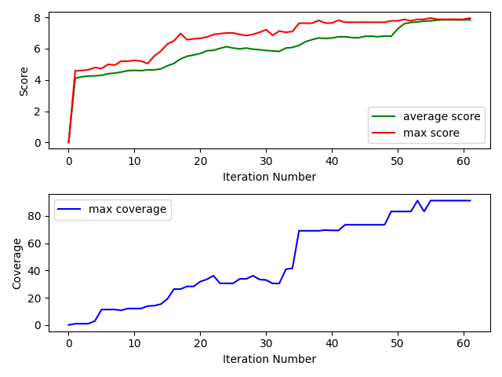

# Genetic Decryption Algorithm
*author*: Alon Ravid

## Table of Contents
1. [Solution Representation and Evaluation](#sol)
2. [Evolution of Solutions](#evolve)
3. [Early Convergance and Halting](#conv)
4. [Algorithm Analysis](#algo)
    1. [General Genetic Algorithm](#GGA)
    2. [Darwin Variant](#DGA)
    3. [Lamarck Variant](#LGA)
5. [Summary](#sum)

In this report I will detail my implementation of a genetic algorithm which decrypts a message encrypted via alphabet permution. The underlying assumptions are that files containing a dicionary of frequent words in english, a letter freqency and letter pairs frequency files are given. In addition upper/lower case do not matter, therefore all input is converted to lower case.

In addition to these files, the algorithm will be tested on a range of parameters:
* Generation Size
* Replication Rate
* Crossover Rate
* Mutation Rate
* Number of Mutations
* Score Weights
* Algorithm Type

## Solution Representation and Evaluation 
In this exercise, an encrypted message is created via a permutation of the alphabet, for example swapping all instances of 'a' with 'c'. To break the encryption is to have the permutation table which was used for the encryption, and applying it backwards, meaning a dictionary of characters as keys and also as values is a valid representation to the solutions of this probelm.

At first I attempted to represent the solutions this way, but after several runs I had decided to optimize the running time by replacing the dictionaries and direct representation by characters, to a representation of solutions using a numpy array of integers between 0 and 25 which are then shifted around. If in the first place of the array is the number 2, that means the algorithm will swap 'a' with 'c', which is the letter of the 2nd cell in the array containing the alphabet.

To evaluate a solution, I applied the permutation as described above on the encoded message, and then I calculated a solution's score by evaluating each word in the following way:

* If the word is in the dictionary, its score is 1.

* If it isn't, the minimal hamming distance between it all other words of the same length from the dictionary is calculated and divided by the word's length. If the result it is less than 0.5, that means over half of the characters would need to be replaced for the word to become a valid word, which is bad, and its score is 0. If its less than 0.5, the score is equal to 1 minus the hamming distance.

The logic behind this is that words that are closer to valid words will have a better chance of turning into them via mutation.
 
In addition, difference between its letters frequencies distribution from the given letter frequencies distribution, and the difference between its paris frequencies distribution from the given letter paris frequencies distribution, each multiplyed by a weight, presented in the following equation where ham(word) is a word's hamming distance as above:

$$score = a \cdot \sum_{word}(\frac {1-ham(word)} {\#words})  + b \cdot \sum_{letter} \frac{(sol\_freq-dict\_freq)^2} {message\_length} + c \cdot \sum_{pair} \frac{(sol\_freq-dict\_freq)^2} {message\_length-1}$$

## Evolution of Solutions 
In order to apply evolutionary pressure over a generation of solutions while creating a greater variance of solutions, 3 rules were applied during the creation of a new generation:

1.The best solutions was copied "as is" once, and several times more each being mutated as usual.
2.The rest of the solutions were created by crossing over two solutions at a time. The solutions were picked via linear sampling, that is the chance to pick a solution was equal to its score's proportion out of the sum of all scores.
3.All solutions generated except the very first were mutated, where for a set number of times it had a relatively high chance to have one of its cells swapped with another.

The crossing over was applied by taking two arrays, randomly generating a number in between 1 and 25, and then "cutting" both arrays at that index, and then gluing them together such that the first solution's first part is glued to the second solution's second part, and the second solution's first part is glued to the first solution's second part.

Afterwards, the solutions's validty was checked and fixed by searching for double letter and missing letters that can be created this way, swapping the first instace of a double letter with a missing letter.

## Early Convergance Problem and Halting
A problem facing genetic algorithms is an early convergence to a local maximum point. Because the solution with the highest score is replicated multiple times at the next generation, and a solution's chance to be chosen for crossover is defined as the porportion of its score to the total score of all solutions, the highest scoring ones can replace the majority of other solutions.

When this happens, we remain with a much less diverse population which is concentrated around a local maximum, without the abilty to overcome it and thus becoming stuck there. In order to overcome this problem, if for the past 5 generations the best solution has not changed, the algorithm checks the coverage of valid words over the decoded message words.

If the coverage is lower than 50%, that means the best solution is stuck but the current solution is far from the optimal one, since a large majority of the message's words should be found in the dictionary. In this case the algorithm "resets", generating a new random generation and continues from there to the next generation, without reseting the fitness count.

Otherwise the coverage is more than 50%, which means we likely have found a good solution and the algorithm halts and returns the current best solution.

 
\pagebreak 

## Algorithm Analysis

### General Gentic Algorithm 
Initially I had to experiment with a variety of fitness function and parameters until I managed to find a fitness function which consistently converged with high coverage and within a reasonable number of fitness calls, with the following parameters:
* Generation Size: 200
* Replication Rate: 0.3
* Crossover Rate: 0.7
* Mutation Rate: 0.8
* Number of Mutations: 5
* Score Weights: word:20, letters:5, pairs:13

While searching for a working combination, I had encountered a persistent problem which was quite hard to tackle:

Often times the algorithm had come close to fully decoding the message, yet had a handful of characters which were swapped, particulary characters with low frequency such as x and j. I had attempted to fix this problem in a multitude of ways,such as increasing the weight of pairs of characters in hope that the x will be paired with its more common combination pair correctly, increasing the mutation rate and many more methods. Despite my attempts, it often took as many iterations to reach this local maximum as it took to overcome it. Eventually I solved it after several major changes to the fitness function and mutation method, where once it had converged to a local maximum with high enough coverage, the replication rate was increased to 0.5, but the number of mutations was reduced to one, as there were many solutions with a handful of incorrect letters which were then one by one fixed a single mutation at a time, throughout a few more generations.

After successfully finding a fitness function and parameters which consistenly work, I had started by tuning the weights of the scores, the results are:

| word weight| letter weight| pair weight | average fitness count | average score | average coverage  |
|------------|--------------|------------|---------------|-------|--------|
| 20         | 5            | 13         | 9386          | 37.83 | 98%  |
| 10         | 7            | 3          | 9560          | 19.89 | 96%  |
| 5          | 1            | 0          | 10320         | 5.98  | 99%  |
| 3          | 1            | 0          | 9340          | 3.99  | 99%  |
| 5          | 3            | 1          | 9160          | 8.95  | 97%  |
| 1          | 1            | 1          | 10240         | 2.99  | 99%  |

Seeing as the 5,3,0 weights yeild the lowest average fitness calls, alongside the highest possilbe coverage, I had decided to proceed and analyse the generation size with these weights.

 
\pagebreak 

The result:
| generation size | average fitness count | average score | average cover |
|----------|---------------|---------------|---------------|
| 75      | 6300          | 3.97          | 97%         |
| 100      | 5250          | 3.98          | 99%         |
| 150      | 6690          | 3.97          | 97%         |
| 200      | 10060         | 3.99          | 99%         |

Tested with generation size = 100, number of mutaions = 5 the results for mutation rates are:
| mutation rate | average fitness count | average score | average cover |
|----------|---------------|---------------|---------------|
| 0.2      | 6300          | 3.84          | 78%         |
| 0.4      | 5650          | 3.88          | 83%         |
| 0.6      | 6690          | 3.96          | 95%         |
| 0.8      | 5250          | 3.98          | 99%         |
| 0.9      | 4700         | 3.94          | 92%         |

 
\pagebreak 

representitive run graph:

 
\pagebreak 

### Darwin Variant 
I implemented the darwin genetic algorithm by first checking a solution's score. Afterwards,
the algorithm made a swap of two cells in the solution, and checked the new solution's score.
If the new score is higher, the solution is assigned this new score, but without the swap being applied to it. It did so N times, afterwhich the algorithm continued as the general genetic algorithm, but with the new score.

Tested with mutation rate = 0.8, number of mutaions = 5, swap number = 3 the results for mutation rates are:
| generation size | average fitness count | average score | average cover |
|----------|----------------------|---------------|---------------|
| 100      | 18000                | 3.94          | 97%           |
| 150      | 37400                | 3.93          | 80%           |
| 200      | 45000                | 3.98          | 99%           |

Tested with generation size = 100, mutation rate = 0.8, number of mutaions = 5 the results for swap numbers are:
| swaps | average fitness count | average score | average cover |
|-------|----------------------|---------------|---------------|
| 3      | 17100                | 3.94          | 97%          |
| 4     | 45000                | 3.98          | 99%           |
| 5     | 68400                | 3.98          | 99%           |
| 6     | 65800                | 3.98          | 99%           |

When trying to test the Darwin variant with the above parameters, the algorithm had failed to converge in all of my attempts. I had decided to manually play with the parameters, eventually finding some that manage to converge, although the result isn't great.

I tried a higher mutation rate with the 26 potential mutations, but it did not seem to improve any of the statistics.

Tested with generation size = 150, number of mutaions = 26, swaps = 5,
words wieght = 3, letter wieght = 1, and  pair weight = 0:
| mutation rate | average fitness count | average score | average cover |
|---------------|---------------|---------------|---------------
| 0.04          | 54900                | 7.95          | 91%           |
| 0.05          | 28800                | 3.75        | 60%           |
| 0.06          | 39600                | 3.53        | 53%           |
| 0.2          | 63000                | 3.72       | 59%           |

 
\pagebreak 

representitive run graph:

 
\pagebreak 

### Lamarck Variant 
I implemented the darwin genetic algorithm by first checking a solution's score. Afterwards,
the algorithm made a swap of two cells in the solution, and checked the new solution's score.
If the new score is higher, the solution is assigned this new score,and the swap is applied to it. It did so N times, afterwhich the algorithm continued as the general genetic algorithm, with the new solution and its new score.

Tested with mutation rate = 0.8, number of mutaions = 5, swap number = 3 the results for mutation rates are:
| generation size | average fitness count | average score | average cover |
|----------|----------------------|---------------|---------------|
| 75       | 32771                | 3.98          | 99%           |
| 100      | 21000                | 3.98          | 99%           |
| 150      | 30750                | 3.98          | 99%           |
| 200      | 41000                | 3.98          | 99%           |

Tested with generation size = 100, mutation rate = 0.8, number of mutaions = 5 the results for swap numbers are:
| swaps | average fitness count | average score | average cover |
|-------|----------------------|---------------|---------------|
| 3     | 18000                | 3.98          | 99%           |
| 4     | 20500                | 3.98          | 99%           |
| 5     | 29400                | 3.98          | 99%           |
| 6     | 35000                | 3.98          | 99%           |

I decided to try and see the results of a mutation method such as the one shown in class, where each cell in the solution has a slight chance to mutate, i.e. swap with another cell.
To achieve this I simply set the number of mutation to 26, and the mutation rates at an order of magnitude less than they were previously. Note even with these parameters, the algorithm first selects a random cell in the solution uniformly, and only then decided whether or not to mutate it according to the mutation rate, so the same cell might be mutated several times in one solution.

Tested with generation size = 100, number of mutaions = 26, swap number = 3 the results for mutation rates are:
| mutation rate | average fitness count | average score | average cover|
|---------------|----------------------|---------------|---------------|
| 0.03          | 17200                | 3.98          | 99%           |
| 0.04          | 16000                | 3.98          | 99%           |
| 0.05          | 24000                | 3.98          | 99%           |
| 0.06          | 38560                | 3.99          | 99%           |
| 0.08          | 48100                | 3.98          | 99%           |

 
\pagebreak 

representitive run graph:

## Summary 
### Algorithm Comparison
The above results show that the generic genetic algorithm, once properly tuned, performs much better on the encoded message than the Darwin and Lamarck best tuned variants. The genetic algorithm manages to consistently fully decode the message in 5250 fitness calls on average, while the Darwin variant manages to do so in 17100 fitness calls but with a couple of misplaced letters, and the Lamarck variant in 16000 fitness calls while fully decoding the message. Note that the highest coverage value is 99%, since the last 1% (which before rounding of the results is about 0.45%) is simply not in the dictionary.

The interesting differences between the algorithms are seen in their behaviour when run with the optimal parameters found, but with different mutation rates:
* The generic and Darwin algorithms shows a much higher variance of coverage, where changing the mutation rate can lead to a range of results from 78% to 99% for the first, and well bellow 50% for the latter, as it kept reseting which only happens if it has not found a different best solution for 5 generations, and the coverage is bellow 50%.
* The Lamarck variant showed robustness and even improvement in the face of such changes, remaining at 99% coverage and reducing its needed fitness calls.

This shows that the genric algorithm is the fastets, and when tuned is the best, but in a case of parameter changes and general stabilty the Lamarck is better as it is more robust.

### Graph Analysis
In all 3 graphs presented above, and many more which were not shown here, the upper score graphs consistently show an initial sharp rise of the maximum and average score values, which then turns into slow but steady rise up to the maximum (which in all cases where the optimal wieghts used was 3.98).

The lower coverage graph shows an opposite sharp rise - it starts rising quite slowly, and after 10-20 iterations it begins to rise faster until it hits a point where a very sharp rise occurs, all the way to the maximum coverage.

This is explained by the the heuristic of calculating the hamming distance, described above. The algorithm takes 1 minus the normalized value calculated, meaning each solution will try to minimize its sum of hamming distances, which leads to the rapid increase in score at the begining, as it picks mutations which bring its words closer to valid ones.

The coverage increase spike follows it, but is not parallel to it, because while the hamming of each word is minimized, any value which is not 0 means it is not a valid word yet, and therefore will not contribute to the coverage calculation. Since the hamming distance is linear, the algorithm will benefit more by decreasing the distances of several words than by reducing one word's distance to 0. This means that only after it has minimized most words' distances, it will benefit more by reducing individual words' distance to 0, which is represented by the spike in coverage we see later on in the runs.